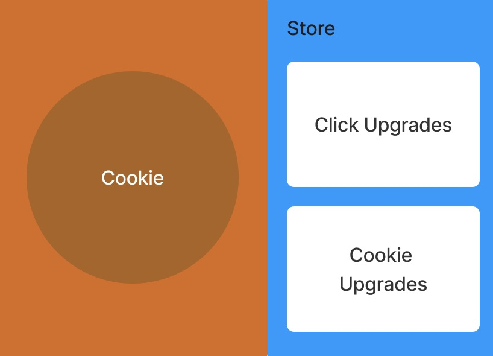
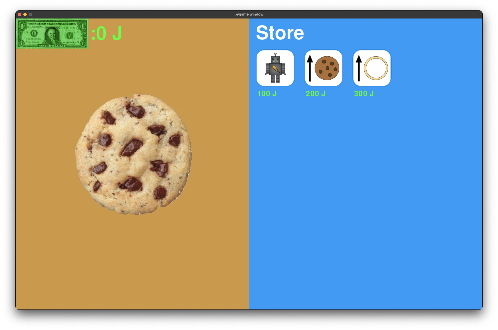

[](https://classroom.github.com/online_ide?assignment_repo_id=14588688&assignment_repo_type=AssignmentRepo)

:warning: Everything between << >> needs to be replaced (remove << >> after replacing)

# Cookie Clicker
## CS110 Final Project  Spring, 2024

## Team Members

Andrew Li

***

## Project Description

I will be creating a cookie clicker game. I will make this different from the rest by featuring more than one type of cookie.

***    

## GUI Design

### Initial Design



### Final Design



## Program Design

### Features

1. Start menu
2. Various cookies
3. Super cookies
4. Shop
5. End screen

### Classes

- << You should have a list of each of your classes with a description >>
- Cookie
This class will create the cookie sprites.
- Background
This will take care of the different background colors.

## ATP

| Step                 |Procedure             |Expected Results                   |
|----------------------|:--------------------:|----------------------------------:|
|  1                   | Run Counter Program  |GUI window appears with count = 0  |
|  2                   | click count button   | display changes to count = 1      |
etc...

## Test #1
- Step 1: Start Game
    - Go to src/controller.py, then open terminal to type:
        - ```py
          python3 controller.py
          ```
        - Click the Start button
- **Expected Outcome**
  - The starting screen disappears, and the main game screen appears

## Test #2
- Step 2: Currency
    - Click on the realistic chocolate chip cookie on the left
- **Expected Outcome**
  - The Jojo Siwa currency increases by 1
            
